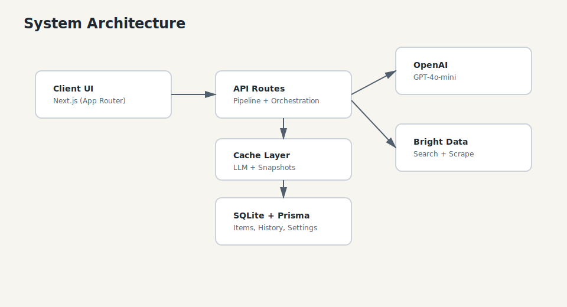
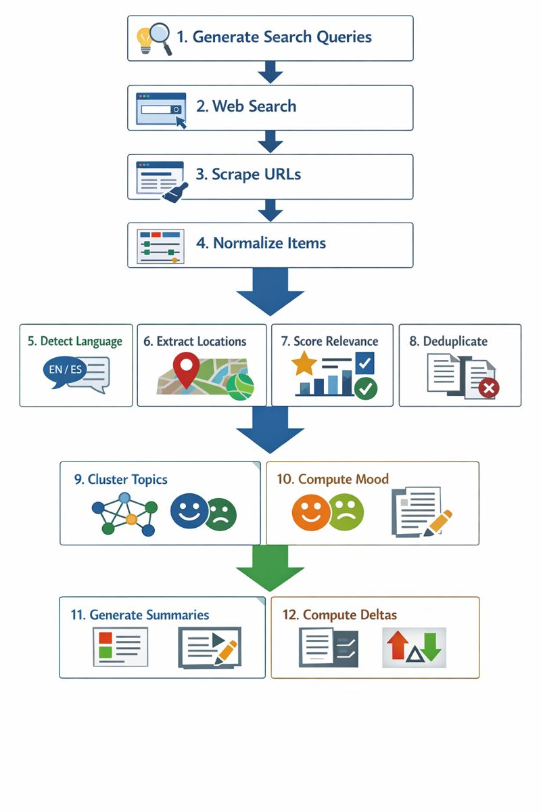

# Internet Mood Radar

Real-time global mood tracking from the internet. Track what's happening across the world, how people react, and why.

> **V1: World** - Global mood tracking across 6 regions with interactive world map visualization.

## What It Does

1. **What is happening right now?** - Aggregates news and content from web search
2. **How is the public reacting?** - Analyzes sentiment from discovered sources
3. **Why does the mood look like this?** - Provides receipts/evidence for every claim
4. **What changed vs yesterday?** - Shows delta trends with visual indicators
5. **Where is it happening?** - Extracts locations and displays on interactive world map

## Features

- **Global Coverage** - Track mood across 6 regions: Middle East, Europe, North America, Asia Pacific, South America, Africa
- **Interactive World Map** - Mood-colored markers with location extraction and geocoding
- **Dynamic Content Discovery** - Web search + scraping finds real-time content automatically
- **LLM-Generated Region Configs** - AI generates optimal search queries per region (cached 30 days)
- **Receipts-First Credibility** - Every summary links to real source items
- **Deterministic Mood Scoring** - Emotions computed algorithmically, not guessed
- **LLM-Grounded Summaries** - AI generates summaries based only on provided evidence
- **Delta Tracking** - Compare today's mood vs yesterday's snapshot
- **Historical Data** - View trends over time with charts and breakdowns

## Regions

| Region | Countries |
|--------|-----------|
| **Middle East** | Israel, Lebanon, Jordan, Syria, Egypt, Saudi Arabia, UAE, Iran, Iraq |
| **Europe** | Germany, France, UK, Italy, Spain, Netherlands, Poland, Sweden |
| **North America** | USA, Canada, Mexico |
| **Asia Pacific** | Japan, South Korea, China, India, Australia, Singapore |
| **South America** | Brazil, Argentina, Chile, Colombia |
| **Africa** | South Africa, Nigeria, Egypt, Kenya, Morocco, Ethiopia, Ghana, Tanzania |

## Quick Start

### Prerequisites

- Node.js 18+
- npm or yarn
- **OpenAI API key** - Get from [platform.openai.com/api-keys](https://platform.openai.com/api-keys)
- **Bright Data API key** - Get from [brightdata.com](https://brightdata.com)

### Installation

```bash
# Clone the repository
git clone https://github.com/ScrapeAlchemist/Internet-Mood-Radar.git
cd Internet-Mood-Radar

# Install dependencies
npm install

# Copy environment file and add your API keys
cp .env.example .env

# Edit .env and add your API keys:
# - OPENAI_API_KEY (required)
# - BRIGHTDATA_API_KEY (required)

# Generate Prisma client
npm run db:generate

# Push database schema
npm run db:push

# Start development server
npm run dev
```

Open [http://localhost:3000](http://localhost:3000) to see the app.

## Architecture

<p align="center">
  
</p>

### Data Pipeline

When fetching fresh data, the app executes this pipeline:

<p align="center">
  
</p>

### How Content Discovery Works

1. **LLM generates region-specific search queries** - Based on country config, language, and current events
2. **Web search finds relevant URLs** - Using Bright Data's search API
3. **Smart URL selection** - LLM picks the most relevant URLs to scrape
4. **Content scraping** - Bright Data scrapes and extracts article content
5. **Location extraction** - Identifies cities, countries, and coordinates from content
6. **Normalization** - All items converted to unified `NormalizedItem` format

### Emotion Taxonomy

The mood engine scores these emotions:

- **Anger** - Outrage, fury, hatred
- **Anxiety / Tension** - Fear, worry, alerts
- **Sadness / Grief** - Loss, tragedy, mourning
- **Resilience / Determination** - Strength, unity, fighting spirit
- **Hope** - Peace, progress, optimism
- **Excitement** - Success, celebration, achievement
- **Cynicism / Sarcasm** - Skepticism, dark humor
- **Neutral / Informational** - Factual, no emotional tone

### Tension Index

The Tension Index (0-100) is calculated from emotion distribution:

```typescript
tension = (anger + anxiety + sadness*0.7 + cynicism*0.4)
        - (resilience*0.5 + hope*0.7 + excitement*0.3) * 0.5
```

## LLM Grounding

The LLM (GPT-4o-mini) is **strictly grounded** - it can only use information provided to it:

### Input to LLM

```typescript
{
  topicKeywords: string[],     // Extracted keywords
  aggregates: {
    itemCount: number,
    avgEngagement: number,
    emotionMix: EmotionDistribution
  },
  receipts: [                  // 3-5 evidence items
    {
      title: string,
      snippet: string,
      translatedSnippet?: string,  // For non-English
      url: string
    }
  ]
}
```

### LLM Rules

1. **No invention** - LLM must not introduce facts not in receipts
2. **Fallback response** - If evidence is weak: "Not enough evidence yet."
3. **English output** - All LLM outputs are in English
4. **Original preserved** - Original language shown in UI, translation hints for LLM

### Caching

LLM outputs are cached for 4 hours (configurable via `LLM_CACHE_TTL_HOURS`).

## API Endpoints

### GET /api/pulse

Returns the current mood data for selected regions.

**Query Parameters:**

| Parameter | Values | Default | Description |
|-----------|--------|---------|-------------|
| window | 1h, 6h, 24h | 6h | Time window for data |

**Response:**

```typescript
{
  tensionIndex: number,        // 0-100
  tensionDelta: number,        // Change vs yesterday
  emotions: EmotionWithDelta[],
  overallSummary: string,      // English, 1-3 sentences
  topics: Topic[],             // 8-12 topic clusters
  countryMoods: CountryMood[], // Per-country breakdown with locations
  receiptsFeed: Receipt[],     // 10-20 evidence items
  errors: NonFatalError[],     // Source errors (non-fatal)
  fetchedAt: Date,
  window: string
}
```

### GET /api/health

Returns system health status and source statistics.

### GET /api/history

Returns historical mood data for trend analysis.

### POST /api/rescan

Clears all caches to force fresh data on the next request.

### GET/POST /api/settings

Manage app settings (regions, language, categories).

### GET /api/boundary

Returns geographic boundary data for regions.

## Snapshots & Deltas

### Creating Snapshots

Run the snapshot script daily (e.g., via cron):

```bash
npm run snapshot
```

This saves:
- Tension index
- Emotion distribution
- Top topic keywords and receipt IDs
- Cached LLM outputs

### Delta Calculation

When computing deltas, the app:
1. Loads yesterday's snapshot (by date)
2. Compares current tension to yesterday's
3. Identifies new topics (low keyword overlap with yesterday)
4. Shows emotion changes with arrows

## Database Schema

SQLite database with Prisma ORM. Models:

| Model | Purpose |
|-------|---------|
| `Item` | Normalized items from all sources |
| `LLMCache` | Cached LLM outputs (4hr TTL) |
| `Snapshot` | Daily mood snapshots for delta calculation |
| `SourceHealth` | Tracks fetch success/failures per source |
| `HistoricalPulse` | Time-series mood data for charts |
| `HistoricalItem` | Archived items for historical queries |
| `Settings` | User app settings (regions, language, etc.) |

## Running Tests

```bash
# Run all tests
npm test

# Run tests in watch mode
npm run test:watch

# Run specific test file
npm test -- language.test.ts
```

### Test Coverage

- **Language detection** - Hebrew, English, Russian, mixed text
- **Clustering** - Topic grouping, deduplication, keyword extraction
- **Snapshot deltas** - Tension changes, topic comparisons, emotion deltas
- **LLM cache keys** - Hash stability, uniqueness
- **Mood engine** - Emotion scoring, tension calculation, normalization
- **Adapters** - Search adapter, error handling
- **Relevance** - Deduplication, scoring algorithms

## Tech Stack

- **Framework:** Next.js 16 (App Router)
- **Language:** TypeScript
- **Database:** SQLite + Prisma ORM
- **LLM:** OpenAI GPT-4o-mini
- **Web Search/Scraping:** Bright Data
- **Maps:** Leaflet + React-Leaflet
- **Charts:** Recharts
- **NLP:** natural (TF-IDF), franc (language detection)
- **Styling:** CSS (no framework)

## Project Structure

```
src/
├── adapters/              # Data source adapters
│   ├── base.ts            # Base adapter class
│   ├── index.ts           # Adapter exports
│   └── search.ts          # Web search + scraping adapter
├── app/
│   ├── api/
│   │   ├── pulse/         # Main mood data endpoint
│   │   ├── health/        # Health check endpoint
│   │   ├── history/       # Historical data endpoint
│   │   ├── rescan/        # Manual rescan trigger
│   │   ├── settings/      # Settings management
│   │   └── boundary/      # Geographic boundaries
│   ├── history/           # History page
│   ├── topic/[id]/        # Topic detail page
│   ├── debug/             # Debug dashboard
│   └── page.tsx           # Home page (world map)
├── components/
│   ├── map/               # World map components
│   │   ├── WorldMap.tsx
│   │   └── MapControls.tsx
│   ├── history/           # History visualization
│   │   ├── TensionChart.tsx
│   │   ├── EmotionPanel.tsx
│   │   ├── TopicsPanel.tsx
│   │   ├── BreakdownPanel.tsx
│   │   └── ItemsFeed.tsx
│   ├── TensionGauge.tsx   # Tension indicator
│   ├── EmotionBars.tsx    # Emotion distribution
│   ├── TopicCard.tsx      # Topic display
│   ├── NewsFeed.tsx       # Scrollable news feed
│   ├── ReceiptFeed.tsx    # Evidence receipts list
│   ├── SettingsModal.tsx  # App settings UI
│   ├── ErrorBoundary.tsx  # React error boundary
│   └── SummaryBox.tsx     # Summary display
├── contexts/              # React contexts
│   └── LanguageContext.tsx
├── lib/
│   ├── pipeline.ts        # Main data pipeline
│   ├── config.ts          # App configuration
│   ├── mood.ts            # Emotion scoring
│   ├── clustering.ts      # TF-IDF topic clustering
│   ├── llm.ts             # LLM integration + caching
│   ├── geocoding.ts       # Coordinate lookup
│   ├── country-config.ts  # Dynamic country configs
│   ├── country-boundary.ts # Geographic boundaries
│   ├── brightdata.ts      # Bright Data integration
│   ├── search-queries.ts  # Search query generation
│   ├── snapshot.ts        # Daily snapshots
│   ├── settings.ts        # Settings management
│   ├── history.ts         # Historical data
│   ├── health.ts          # Source health tracking
│   ├── relevance.ts       # Deduplication & scoring
│   ├── language.ts        # Language detection
│   ├── debug.ts           # Debug utilities
│   ├── translations.ts    # i18n translations
│   └── mcp-client.ts      # MCP client for Bright Data
├── types/                 # TypeScript types
└── __tests__/             # Test files
scripts/
└── snapshot.ts            # Daily snapshot script
prisma/
└── schema.prisma          # Database schema
```

## License

MIT
